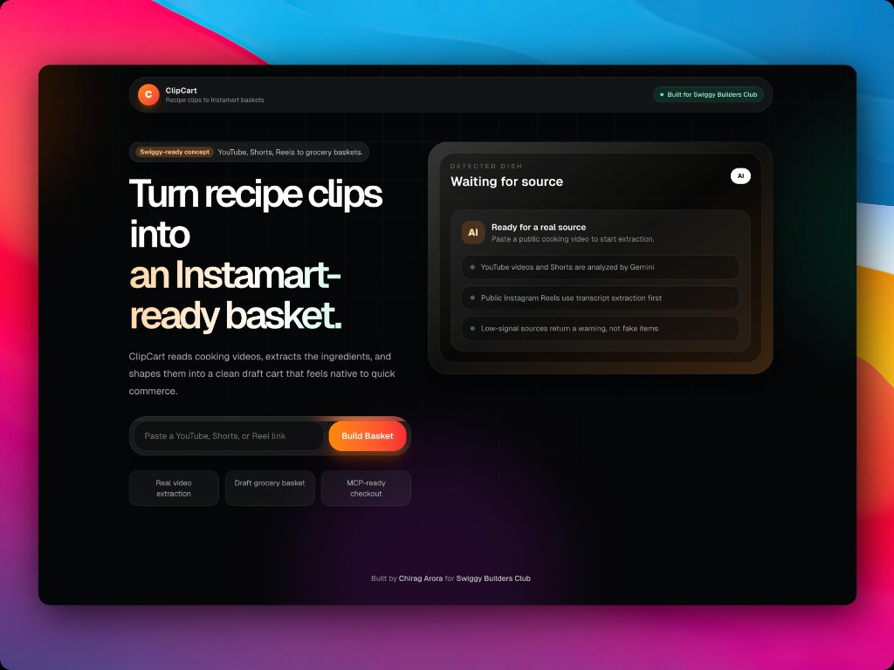
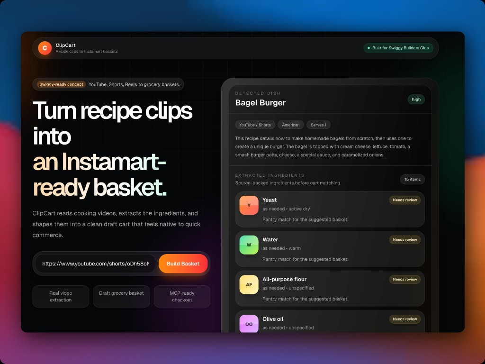

# ClipCart

Recipe clips to Instamart-ready baskets.

ClipCart is an AI-native quick commerce prototype built for Swiggy Builders Club. Paste a cooking video, YouTube Short, or Instagram Reel, and ClipCart extracts the recipe context, identifies shoppable ingredients, and turns them into a polished draft Instamart basket.

The product is designed around one simple belief: the best next action after discovering a recipe is not saving it. It is getting the ingredients delivered.

[Live demo](https://clipcart-theta.vercel.app) · [GitHub](https://github.com/ChiragArora31/ClipCart) · [Swiggy Builders Club](https://mcp.swiggy.com/builders/)



## The problem

Food discovery has moved to video. People find recipes on YouTube, Shorts, Instagram Reels, and creator-led cooking content every day.

But the buying journey is still manual:

- pause the video
- find or infer the ingredients
- guess quantities
- search each item separately
- compare packs and substitutions
- rebuild the basket by hand

ClipCart compresses that into one flow: video to ingredients to draft cart.

## What ClipCart does

- Accepts YouTube videos, YouTube Shorts, and public Instagram Reels.
- Extracts dish name, cuisine, servings, ingredients, quantities, preparation notes, confidence, and review context.
- Builds a draft Instamart-style basket with product rows, estimated pack sizes, prices, subtotal, and ETA.
- Keeps checkout intentionally locked with `Requires Swiggy MCP access`, because the real next step is Instamart MCP integration.
- Lets users copy the ingredient list while real checkout access is pending.



## Why it matters

ClipCart turns recipe inspiration into purchase intent at the exact moment the user is most motivated.

For users, it removes planning friction.

For creators, it makes recipes shoppable.

For Swiggy Instamart, it creates a natural bridge from food discovery to commerce.

For MCPs, it is a clear example of an AI agent doing something useful in the real world: understanding messy media, structuring intent, matching it to commerce primitives, and preparing an action.

## How it works

```text
Video/Reel URL
  -> source detection
  -> transcript/video/description context extraction
  -> Gemini structured recipe extraction
  -> ingredient normalization
  -> draft Instamart basket
  -> locked MCP checkout handoff
```

Under the hood:

- YouTube videos and Shorts are analyzed with Gemini video/context understanding.
- YouTube description text is used as a fallback when direct video analysis is unavailable.
- Instagram Reels use transcript/context extraction for public Reels.
- Gemini returns structured JSON for ingredients, quantities, confidence, missing context, and review notes.
- The UI maps extracted ingredients into a draft cart preview that can later be replaced by real Instamart catalog and cart MCP calls.

## MCP integration plan

The app is already shaped around a future `InstamartClient` layer. Once Swiggy MCP access is available, the draft cart layer can be replaced with real calls for:

- catalog search
- SKU matching
- pack-size resolution
- inventory availability
- substitutions
- cart creation
- checkout handoff

The current locked checkout state is intentional. It communicates the intended integration clearly without pretending to have production Instamart access.

## Tech stack

- Next.js 16 App Router
- React
- Tailwind CSS
- Gemini API via `@google/genai`
- Apify-based Instagram transcript extraction
- Vercel deployment

The project is intentionally lightweight: no database, no auth layer, and no heavy UI framework. The focus is the product flow, extraction quality, and MCP-readiness.

## Getting started

Install dependencies:

```bash
npm install
```

Create a local environment file:

```bash
cp .env.example .env.local
```

Fill in the required keys:

```bash
GEMINI_API_KEY=your_gemini_api_key
APIFY_TOKEN=your_apify_token_for_instagram_reels
```

Run the development server:

```bash
npm run dev
```

Open [http://localhost:3000](http://localhost:3000).

## Environment variables

| Variable | Required | Purpose |
| --- | --- | --- |
| `GEMINI_API_KEY` | Yes | Extracts structured recipe ingredients from video, transcript, or description context. |
| `APIFY_TOKEN` | For Instagram | Fetches transcript context for public Instagram Reels. |
| `GEMINI_MODEL` | No | Overrides the default Gemini model. |
| `APIFY_INSTAGRAM_TRANSCRIPT_ACTOR` | No | Overrides the default Instagram transcript actor. |

Never commit `.env.local`. The repository includes `.env.example` only as a template.

## Current limitations

- Instamart checkout is not active yet because Swiggy MCP access is required.
- Draft prices and pack sizes are estimated in the MVP. Real values should come from Instamart APIs/MCPs.
- Instagram extraction depends on public Reel availability and accessible transcript/caption context.
- If a source lacks enough recipe signal, ClipCart reports uncertainty instead of inventing missing ingredients.

## Scripts

```bash
npm run dev
npm run lint
npm run build
npm run start
```

## Built by

Built by [Chirag Arora](https://www.linkedin.com/in/chirag-arora-3107/) for [Swiggy Builders Club](https://mcp.swiggy.com/builders/).
